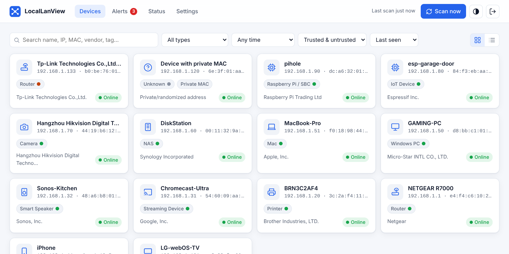

# LocalLanView

See every device on your network, what it is, and what it's running. One
binary, a web dashboard, and nothing ever leaves your network.



> Only scan networks you own or are authorized to administer.

## Features

- Finds devices with the ARP table, mDNS/Bonjour, SSDP/UPnP, NetBIOS and
  LLMNR, plus raw ARP and ICMP sweeps when run as admin/root
- Light port scan with banner grabbing (rate limited, `-no-port-scan` to skip)
- Vendor lookup from the embedded IEEE registry (MA-L, MA-M, MA-S);
  randomized MACs are labeled as such
- Guesses device type (router, printer, TV, phone...) and shows why and how sure
- Remembers first/last seen, IP and hostname history
- Alerts for new devices, newly opened ports, and an IP moving to a new MAC
- Rename, tag and mark devices as trusted; export to CSV/JSON
- Fully offline: no telemetry, no update checks, no CDN

## Quick start

Download a binary from Releases, or build it (below), then:

```sh
./LocalLanView
```

It opens `http://127.0.0.1:8787`. The first run prints a random password
once. Log in as `admin` and change it under Settings.

## Privileges

| `-mode` | Behavior |
|---|---|
| `auto` (default) | Uses elevated features if already running as admin/root, otherwise standard |
| `std` | Never uses elevated features |
| `elv` | Requires admin/root, exits with instructions otherwise |

Elevated mode adds the raw ARP sweep and ICMP, which find devices that
ignore everything else. It never asks for elevation itself. On Linux you
can skip root with:

```sh
sudo setcap cap_net_raw+ep ./LocalLanView
```

When started with `sudo`, it drops back to your user after opening its
sockets. The Status page shows which features are on and why.

## Options

| Flag | Default | |
|---|---|---|
| `-addr` | `127.0.0.1:8787` | `host:port`, `:port` or `port` (the last two bind to loopback) |
| `-addr-fallback` | off | Use a free port if the chosen one is taken |
| `-user` | `admin` | Console username |
| `-password-file` | | Read the password from a file |
| `-set-password` | | Prompt for a new password (or take it from the file/env) |
| `-mode` | `auto` | `auto`, `std` or `elv` |
| `-data-dir` | per-user config dir | Database location |
| `-scan-interval` | `5m` | Time between scans |
| `-interface`, `-subnet` | auto | Override detection (subnet must be on the interface) |
| `-probe-rate` | `100` | Max probe packets per second |
| `-no-port-scan` | off | Skip TCP probes |
| `-tls-cert`, `-tls-key` | | Serve HTTPS with your certificate |
| `-tls-self-signed` | off | Serve HTTPS with a generated certificate |
| `-webhook` | | POST alerts to a local/private URL |
| `-notify` | off | Desktop notifications for alerts |
| `-no-open-browser`, `-version` | | |

The password can also come from `LOCALLANVIEW_PASSWORD`. There's no
`-password` flag on purpose: it would show up in `ps` and shell history.

### Opening the console to your LAN

```sh
LOCALLANVIEW_PASSWORD='a long passphrase' ./LocalLanView -addr 0.0.0.0:8787 -tls-self-signed
```

Binding to anything other than loopback is refused until you've set your
own strong password. Without TLS you'll get a warning, since logins would
travel in plain text.

## Limitations

- It sees only the subnet it's attached to. VLANs and guest networks need
  their own instance.
- Sleeping devices and ones that ignore probes look offline. That's why
  devices show "last seen" instead of up/down.
- Randomized (private) MACs hide the vendor and can make one phone look
  like several devices over time. Names and services still help.

## Building

Needs Go only.

```sh
make build      # this machine
make dist       # all OS/arch combinations into dist/, with SHA256SUMS
make test
```

On Windows: `.\build.ps1` or `.\build.ps1 -Dist`. Builds are static
(`CGO_ENABLED=0`) and reproducible.

## More

- [Architecture](docs/architecture.md)
- [Security notes and threat model](docs/security.md)
- [Contributing](CONTRIBUTING.md)

## License

MIT
